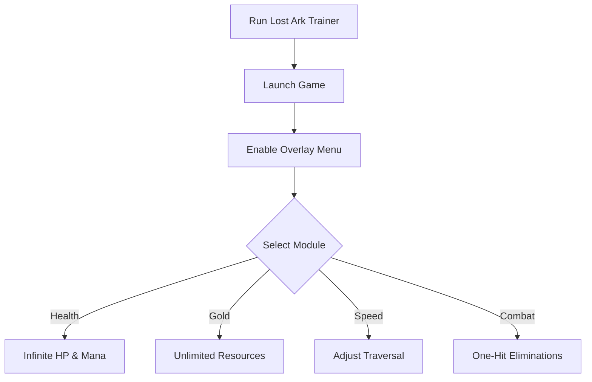

# Lost Ark Trainer ⚔️

The **Lost Ark Trainer Software** is built for players who want more control over their adventures. With in-game overlays, hotkey toggles, and customizable configs, you can adjust gold, stamina, combat strength, and exploration speed to match your playstyle.

[](#)
[](#)
[](#)
[](#)

---

## 📝 Overview

Lost Ark offers expansive worlds, complex combat, and endless grind. The trainer helps you **train builds, test mechanics, and explore maps** by offering adjustable resources, combat boosts, and traversal options. Perfect for **offline practice and sandbox-style sessions**.

\[!IMPORTANT]
This trainer runs in memory only. It does not modify core game files or saves.

---

## ⭐ Features

* **Infinite Health & Mana** – Test skills and rotations without dying.
* **Unlimited Gold & Resources** – Experiment with builds and gear freely.
* **Speed Adjustments** – Slow down or accelerate movement for training.
* **One-Hit Eliminations** – Practice clears against mobs and bosses.
* **Overlay Menu** – Toggle features live while in-game.
* **Hotkey Profiles** – Save multiple setups for PvE, farming, or exploration.

---

## 🖥 Compatibility

| Platform       | Supported | Notes              |
| -------------- | --------- | ------------------ |
| Windows 10/11  | ✅         | Fully supported    |
| Steam          | ✅         | Stable integration |
| Linux (Proton) | ⚠️        | Limited support    |
| Consoles       | ❌         | Not supported      |

\[!NOTE]
Accessibility: Fonts, overlay colors, and hotkeys can be customized for clarity and ease of use.

---

## ⚡ Setup Guide

1. **Download** the Lost Ark Trainer package.
2. Extract files into your Lost Ark installation folder.
3. Run `LostArkTrainer.exe` as administrator.
4. Start the game and press `F1` to activate the overlay.
5. Toggle modules with hotkeys or menu.

```ini
[trainer]
health=on
mana=on
gold=999999
speed=1.4x
hotkey_overlay=F1
hotkey_health=F2
```

---

## 🔄 Trainer Workflow



---

## ❓ FAQ

**Q: Does the trainer affect online play?**
A: It is intended for **offline training and private use only**.

**Q: Will it damage my save data?**
A: No, it operates only in memory.

**Q: Can I remap hotkeys?**
A: Yes, through `config.ini`.

**Q: Will there be FPS drops?**
A: Minimal, as the trainer is lightweight and optimized.

**Q: Can I create multiple profiles?**
A: Yes, save different configs for farming, PvE, or sandbox testing.

---

## 🚀 Final Thoughts

The **Lost Ark Trainer** empowers players with **configurable boosts, overlays, and resources** to shape their adventures. Whether you want to experiment with builds, farm without limits, or explore more freely, it’s the perfect practice companion.

---

